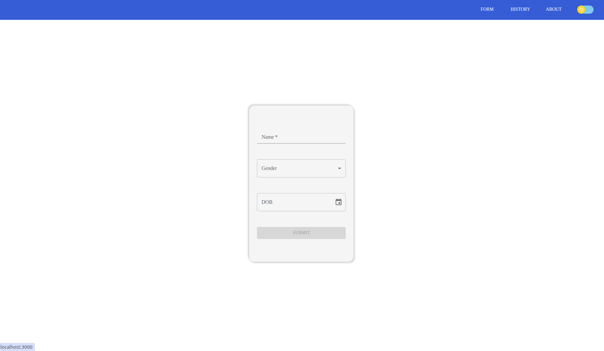
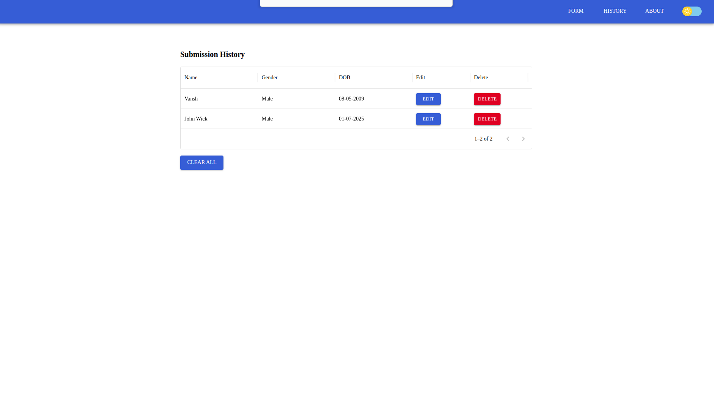
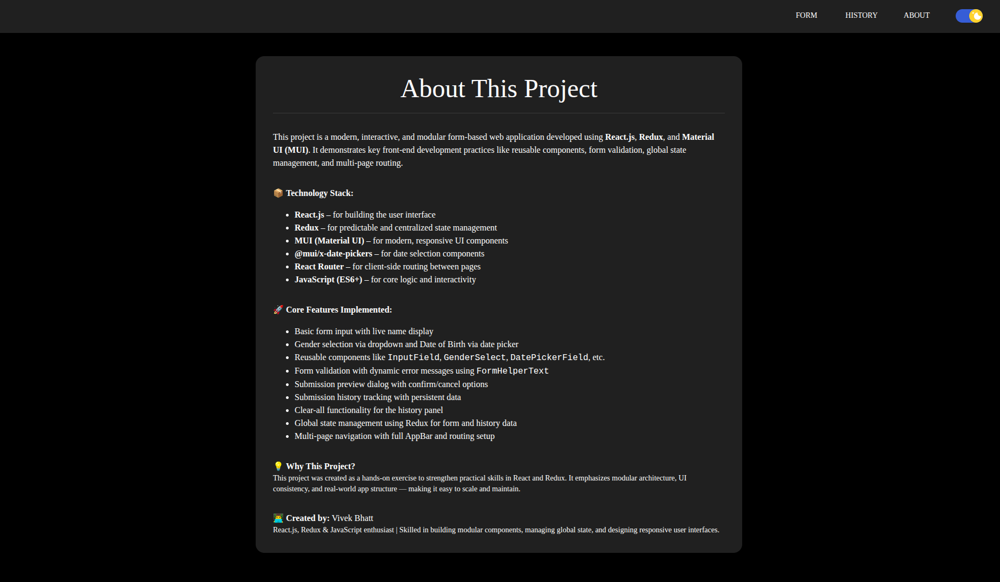
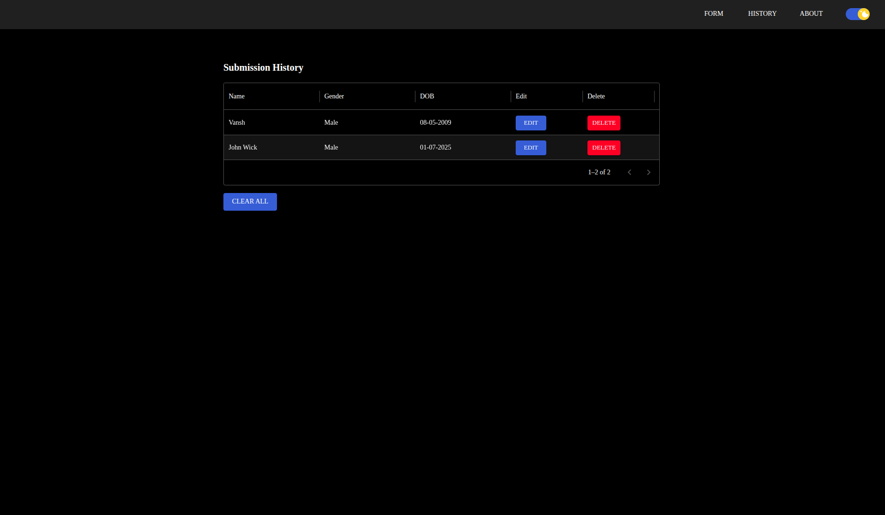

# <span style="color:#1976d2">📋Form with MUI</span> – A 10-Stage React Project 🚀</h1>

A modern, interactive form-based web application built with **React.js**, **Redux Toolkit**, and **Material-UI**.
This project showcases progressive enhancement across **10 feature branches**, emphasizing reusable components, validation, routing, theming, and state management.

## 🚀 Live Demo
[Click here to view the Form with MUI](https://vivekbhatt02.github.io/form-with-mui)


## 📸 Screenshots

###  Light Mode

<p align="center">
  
  
</p>

###  Dark Mode

<p align="center">
  
  
</p>


---

## 🛠️ Tech Stack

- ⚛️ **React.js** – Component-based UI
- 🎯 **Redux Toolkit** – Global state management
- 🎨 **Material-UI (MUI)** – React UI component library
- 🌍 **React Router** – Client-side routing
- 📆 **@mui/x-date-pickers** – Date picker integration
- 🧩 **@mui/icons-material** – Material Design icons

---

## ✨ Features

- ✅ Dynamic multi-field form
- ✅ Real-time validation & error messaging
- ✅ Dark/Light theme toggle with smooth transitions
- ✅ Redux state management
- ✅ Submission history with timestamps
- ✅ Reusable form components
- ✅ Preview dialog before submission
- ✅ Responsive layout
- ✅ CRUD for form entries
- ✅ Multi-page navigation with React Router

---

## 🧱 Development Stages

| Stage | Description                                                                  | Branch |
|-------|------------------------------------------------------------------------------|--------|
| 1     | Setup + basic name form                                                      | `feature-1` |
| 2     | Add gender & date of birth fields                                            | `feature-2` |
| 3     | Extract reusable components                                                  | `feature-3` |
| 4     | Add robust validation                                                        | `feature-4` |
| 5     | Build submission history tracker and used Redux Toolkit for state management | `feature-5` |
| 6     | Add preview confirmation dialog                                              | `feature-6` |
| 7     | Setup multi-page navigation                                                  | `feature-7` |
| 8     | Add CRUD (edit/delete) functionality                                         | `feature-8` |
| 9     | Skipped – originally intended to use Context API, but Redux Toolkit is already handling the submission list state| `feature-9` |
| 10    | Final polish: Theming, UX improvements                                       | `feature-10` |

---

## ⚙️ Getting Started

This project was bootstrapped with [Create React App](https://github.com/facebook/create-react-app).

### Prerequisites

- Node.js (v14+)
- npm or yarn

### Installation

```bash
git clone https://github.com/Vivekbhatt02/form-with-mui
cd react-form-builder
npm install   # or yarn
npm start     # or yarn start
```

Open [http://localhost:3000](http://localhost:3000) to view the app in the browser.

---

## 📦 Available Scripts

In the project directory, you can run:

### `npm start`

Runs the app in the development mode.

### `npm test`

Launches the test runner in interactive watch mode.

### `npm run build`

Builds the app for production to the `build` folder.

### `npm run eject`

**Note: this is a one-way operation. Once you eject, you can't go back!**

---

## 🌿 Explore Feature Branches

```bash

git branch -a          # List all branches
git checkout feature-5 # Switch to specific stage
git checkout main      # Go back to main
```


---

## 📚 Learn More

* [Create React App Docs](https://facebook.github.io/create-react-app/docs/getting-started)
* [React Documentation](https://reactjs.org/)
* [Material-UI Docs](https://mui.com/)
* [Redux Toolkit Docs](https://redux-toolkit.js.org/)
* [React Router Docs](https://reactrouter.com/)

---

## 🙌 Contributing

PRs welcome!

```bash
# Fork the repo
# Create your branch
git checkout -b feature/AmazingFeature
# Commit changes
git commit -m "Add AmazingFeature"
# Push and submit PR
git push origin feature/AmazingFeature
```

---


## 👨‍💻 Author

**Vivek Bhatt**
Frontend Developer | React, Redux, MUI Enthusiast
[GitHub](https://github.com/Vivekbhatt02)

---

> *Built with ❤️ using React.js, Redux Toolkit, and Material-UI*
> Built with ❤️ using React.js, Redux Toolkit, and Material-UI

Thanks for checking out the project!  
Feel free to fork it, open issues, or contribute.  
Happy coding! 🚀
